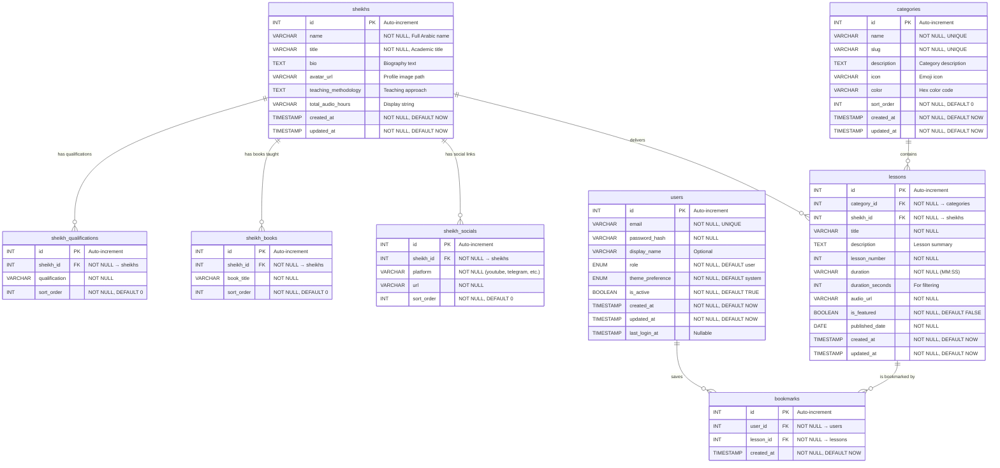
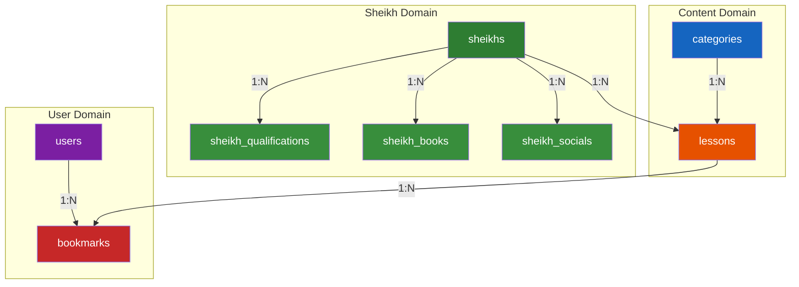

# Entity-Relationship Diagram (ERD)

## Complete ERD

```mermaid
erDiagram
    sheikhs {
        INT id PK "Auto-increment"
        VARCHAR name "NOT NULL, Full Arabic name"
        VARCHAR title "NOT NULL, Academic title"
        TEXT bio "Biography text"
        VARCHAR avatar_url "Profile image path"
        TEXT teaching_methodology "Teaching approach"
        VARCHAR total_audio_hours "Display string"
        TIMESTAMP created_at "NOT NULL, DEFAULT NOW"
        TIMESTAMP updated_at "NOT NULL, DEFAULT NOW"
    }

    sheikh_qualifications {
        INT id PK "Auto-increment"
        INT sheikh_id FK "NOT NULL → sheikhs"
        VARCHAR qualification "NOT NULL"
        INT sort_order "NOT NULL, DEFAULT 0"
    }

    sheikh_books {
        INT id PK "Auto-increment"
        INT sheikh_id FK "NOT NULL → sheikhs"
        VARCHAR book_title "NOT NULL"
        INT sort_order "NOT NULL, DEFAULT 0"
    }

    sheikh_socials {
        INT id PK "Auto-increment"
        INT sheikh_id FK "NOT NULL → sheikhs"
        VARCHAR platform "NOT NULL (youtube, telegram, etc.)"
        VARCHAR url "NOT NULL"
        INT sort_order "NOT NULL, DEFAULT 0"
    }

    categories {
        INT id PK "Auto-increment"
        VARCHAR name "NOT NULL, UNIQUE"
        VARCHAR slug "NOT NULL, UNIQUE"
        TEXT description "Category description"
        VARCHAR icon "Emoji icon"
        VARCHAR color "Hex color code"
        INT sort_order "NOT NULL, DEFAULT 0"
        TIMESTAMP created_at "NOT NULL, DEFAULT NOW"
        TIMESTAMP updated_at "NOT NULL, DEFAULT NOW"
    }

    lessons {
        INT id PK "Auto-increment"
        INT category_id FK "NOT NULL → categories"
        INT sheikh_id FK "NOT NULL → sheikhs"
        VARCHAR title "NOT NULL"
        TEXT description "Lesson summary"
        INT lesson_number "NOT NULL"
        VARCHAR duration "NOT NULL (MM:SS)"
        INT duration_seconds "For filtering"
        VARCHAR audio_url "NOT NULL"
        BOOLEAN is_featured "NOT NULL, DEFAULT FALSE"
        DATE published_date "NOT NULL"
        TIMESTAMP created_at "NOT NULL, DEFAULT NOW"
        TIMESTAMP updated_at "NOT NULL, DEFAULT NOW"
    }

    users {
        INT id PK "Auto-increment"
        VARCHAR email "NOT NULL, UNIQUE"
        VARCHAR password_hash "NOT NULL"
        VARCHAR display_name "Optional"
        ENUM role "NOT NULL, DEFAULT user"
        ENUM theme_preference "NOT NULL, DEFAULT system"
        BOOLEAN is_active "NOT NULL, DEFAULT TRUE"
        TIMESTAMP created_at "NOT NULL, DEFAULT NOW"
        TIMESTAMP updated_at "NOT NULL, DEFAULT NOW"
        TIMESTAMP last_login_at "Nullable"
    }

    bookmarks {
        INT id PK "Auto-increment"
        INT user_id FK "NOT NULL → users"
        INT lesson_id FK "NOT NULL → lessons"
        TIMESTAMP created_at "NOT NULL, DEFAULT NOW"
    }

    sheikhs ||--o{ sheikh_qualifications : "has qualifications"
    sheikhs ||--o{ sheikh_books : "has books taught"
    sheikhs ||--o{ sheikh_socials : "has social links"
    sheikhs ||--o{ lessons : "delivers"
    categories ||--o{ lessons : "contains"
    users ||--o{ bookmarks : "saves"
    lessons ||--o{ bookmarks : "is bookmarked by"
```

## Simplified Relationship Overview

```mermaid
graph TB
    subgraph "Sheikh Domain"
        S["sheikhs"]
        SQ["sheikh_qualifications"]
        SB["sheikh_books"]
        SS["sheikh_socials"]
    end

    subgraph "Content Domain"
        C["categories"]
        L["lessons"]
    end

    subgraph "User Domain"
        U["users"]
        BK["bookmarks"]
    end

    S -->|"1:N"| SQ
    S -->|"1:N"| SB
    S -->|"1:N"| SS
    S -->|"1:N"| L
    C -->|"1:N"| L
    U -->|"1:N"| BK
    L -->|"1:N"| BK

    style S fill:#2E7D32,color:#fff
    style C fill:#1565C0,color:#fff
    style L fill:#E65100,color:#fff
    style U fill:#7B1FA2,color:#fff
    style BK fill:#C62828,color:#fff
    style SQ fill:#388E3C,color:#fff
    style SB fill:#388E3C,color:#fff
    style SS fill:#388E3C,color:#fff
```
